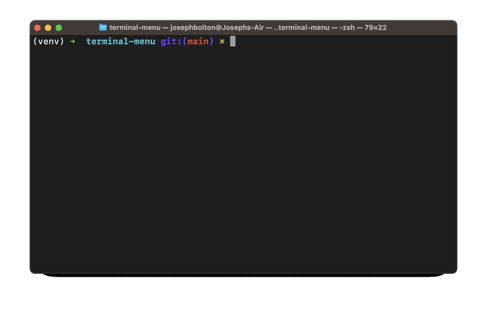
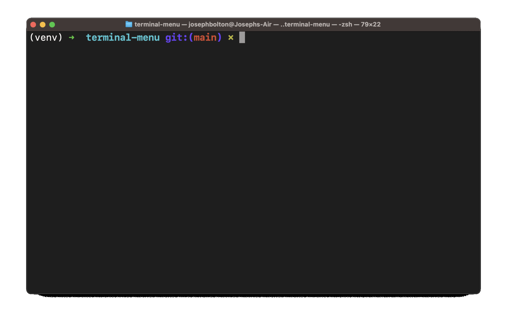

# Terminal Menu using Python 



Here is a minimal usage example:

```python
from terminal_menu import menu
user_choice: str = menu(
    static_menu_text="Please choose an annoying little dog:",
    choices=("Chihuahua", "Pomeranian", "Jack Russell"),
)
print(f"user chose '{user_choice}'")
```



I wanted a simple OS-agnostic interface for creating menus in my python command-line applications (using only the python standard library). 

I could not find one that I liked, so I built this one. 

It is not truly operating system agnostic since it uses the [curses](https://docs.python.org/3/library/curses.html#module-curses) python library, which will not work on a Windows terminal. It works on WSL though.

I purposely contained all of the functionality in a single script ([terminal_menu.py](./terminal_menu.py)) so that this function can be easily included in a project with a minimal footprint. If you don't mind your project looking like a NodeJS project, you can also install it as a package from [PyPI](https://pypi.org/project/terminal-menu/):

```bash
pip install terminal-menu
```

Here is a more complex usage example ([examples/nested_menus.py](./examples/nested_menus.py)):


```python
from terminal_menu import menu

sound_status: str = "On"
video_quality: str = "Low"
persist_menu: bool = True
while persist_menu:
    user_choice: str = menu(
        static_menu_text="-- MAIN MENU --", choices=("New Game", "Options", "Exit")
    )
    if user_choice == "Exit":
        break
    elif user_choice == "New Game":
        user_choice = menu(
            static_menu_text="-- NEW GAME --",
            choices=("Single Player", "Multiplayer", "Back to Main Menu"),
        )
        if user_choice in ("Single Player", "Multiplayer"):
            print(f"User started new {user_choice} game")
            persist_menu = False
    elif user_choice == "Options":
        persist_options_menu: bool = True
        while persist_options_menu:
            user_choice = menu(
                static_menu_text=f"""-- OPTIONS --
Sound is currently {sound_status}
Video quality is currently {video_quality}
""",
                choices=("Sound", "Video", "Back to Main Menu"),
            )
            if user_choice == "Back to Main Menu":
                persist_options_menu = False
            elif user_choice == "Sound":
                user_choice = menu(
                    static_menu_text="-- SOUND OPTIONS --",
                    choices=("Off", "On", "Back to Options"),
                )
                if user_choice in ("Off", "On"):
                    sound_status = user_choice
            elif user_choice == "Video":
                user_choice = menu(
                    static_menu_text="-- VIDEO OPTIONS --",
                    choices=("Low", "Medium", "High", "Back to Options"),
                )
                if user_choice in ("Low", "Medium", "High"):
                    video_quality = user_choice
```
